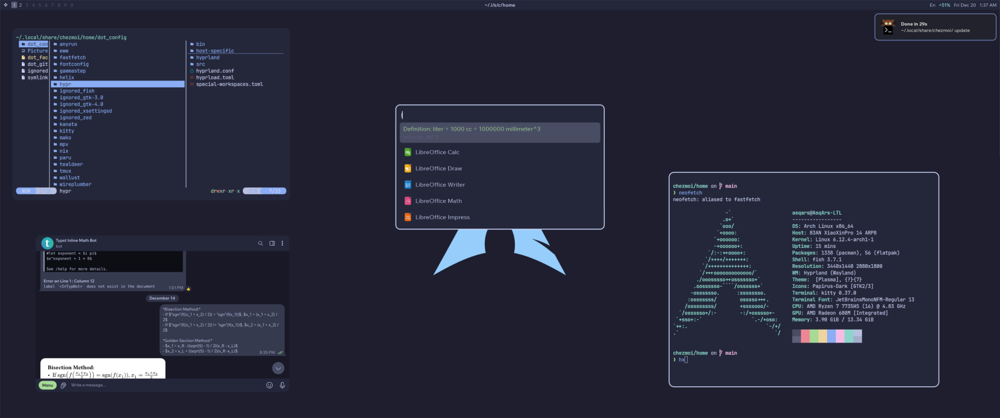

# AsqArs’ Dotfiles

### Components

|       Component        |                                                     Upstream                                                      |
| :--------------------: | :---------------------------------------------------------------------------------------------------------------: |
|           OS           |                                    [Arch Linux](https://github.com/archlinux)                                     |
|        Desktop         |                                  [Hyprland](https://github.com/hyprwm/Hyprland)                                   |
|       GTK Theme        |                              [Materia Dark](https://github.com/nana-4/materia-theme)                              |
|      Cursor Theme      |                             [GoogleDot Blue](https://github.com/ful1e5/Google_Cursor)                             |
|       Icon Theme       |                   [Papirus Dark](https://github.com/PapirusDevelopmentTeam/papirus-icon-theme)                    |
|      Colorscheme       |                         [Catppuccin Macchiato](https://github.com/catppuccin/catppuccin)                          |
| Colorscheme Management |                             [Wallust](https://codeberg.org/explosion-mental/wallust)                              |
|   Proportional Font    |                          [Wix Madefor Text](https://github.com/wix-incubator/wixmadefor)                          |
|    Monospaced Font     | [JetBrains Mono](https://github.com/JetBrains/JetBrainsMono) [Nerd Font](https://github.com/ryanoasis/nerd-fonts) |
|  Application Launcher  |                                    [Anyrun](https://github.com/Kirottu/anyrun)                                    |
|       Status Bar       |                                       [Eww](https://github.com/elkowar/eww)                                       |
|  Notification Center   |                                     [mako](https://github.com/emersion/mako)                                      |
|    GUI Text Editor     |                                   [Zed](https://github.com/zed-industries/zed)                                    |
|    TUI Text Editor     |                                  [Helix](https://github.com/helix-editor/helix)                                   |
|      Web Browser       |                                  [Firefox](https://github.com/mozilla/gecko-dev)                                  |
|      Media Player      |               [mpv](https://github.com/mpv-player/mpv) (want to move to something more for-normies)               |
|    Display Manager     |                                       [SDDM](https://github.com/sddm/sddm)                                        |
| Display Manager Theme  |                             [Sugar Candy](https://github.com/Kangie/sddm-sugar-candy)                             |
|     Screen Locker      |                                  [Swaylock](https://github.com/swaywm/swaylock)                                   |
|    GUI File Manager    |                                     [Nemo](https://github.com/linuxmint/nemo)                                     |
|    TUI File Manager    |                                      [Yazi](https://github.com/sxyazi/yazi)                                       |
|         Git UI         |                                [Lazygit](https://github.com/jesseduffield/lazygit)                                |
|   Terminal Emulator    |    [kitty](https://github.com/kovidgoyal/kitty) (considering using [WezTerm](https://github.com/wez/wezterm))     |
|   Command Line Shell   |                                 [fish](https://github.com/fish-shell/fish-shell)                                  |
|      Shell Prompt      |                                 [Starship](https://github.com/starship/starship)                                  |
|        Show-off        |                              [Fastfetch](https://github.com/fastfetch-cli/fastfetch)                              |
|  Terminal Multiplexer  |      [tmux](https://github.com/tmux/tmux) (considering using [Zellij](https://github.com/zellij-org/zellij))      |
